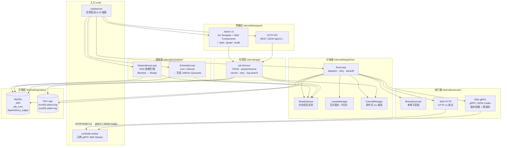
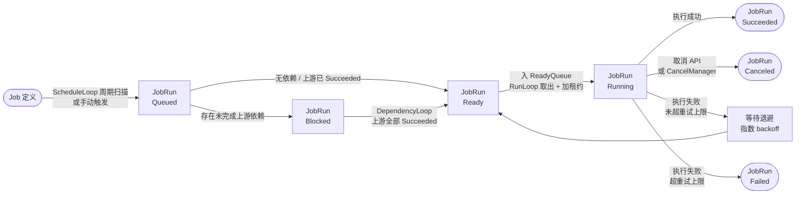

Shell 脚本任务示例：

```json
{
    "name": "cleanup-tmp",
    "description": "clean up temp files every hour",
    "enabled": true,
    "interval_seconds": 3600,
    "executor_type": "shell",
    "shell_script": "find /tmp -name '*.tmp' -mtime +1 -delete\necho 'cleanup done'",
    "shell_shell": "/bin/sh",
    "shell_timeout_seconds": 30
}
```

@@带依赖的任务示例
# Cron Job

一个用 Go 编写的定时任务配置管理系统骨架，当前实现采用“模块化单体 + 控制循环内核”的路线，支持：

- 任务配置管理
- `interval` 和 `cron` 两种调度方式
- SDK 任务、二进制任务、Shell 脚本三类执行模型
- HTTP transport 的 SDK 执行
- gRPC transport 的 SDK 执行
- 任务依赖 DAG 基础能力
- 手动触发
- 暂停和恢复任务
- 运行记录和状态跟踪
- 运行日志分流落盘（stdout/stderr）和检索
- Go template + Web Components 后台页面
- 登录认证（会话 Cookie）

## 当前能力

当前版本已经实现一个可运行的 MVP：

- `Job` 和 `JobRun` 分离建模（executor_type: sdk / binary / shell）
- `ScheduleLoop` 根据调度规则生成 `JobRun`
- `DependencyLoop` 处理被依赖阻塞的任务
- `RunLoop` 从 ready queue 取任务并调用执行器
- MySQL 版 `Repository`、内存版 `Queue`/`Lease`
- 文件版任务日志存储
- 日志流过滤和关键字检索
- JSON API
- 后台任务列表、创建表单、任务详情页、手动触发、暂停恢复、日志页、登录/退出

依赖语义目前是一个务实版实现：

- 下游任务创建或手动触发时，如果存在依赖，会先进入 `Blocked`
- 当所有上游任务的最新一次运行状态为 `Succeeded` 时，下游会被释放到 `Ready`
- 当前没有做复杂 trigger rule，也没有按“同一调度窗口”精确关联上下游 run

## 目录结构

```text
cron-job/
├── cmd/server                  # 服务入口
├── internal/app                # 用例编排
├── internal/domain             # 领域模型和状态机
├── internal/scheduler          # 调度和依赖释放循环
├── internal/dispatcher         # ready queue、lease、run loop
├── internal/executor           # SDK/Binary 执行器
├── internal/repository         # 存储接口和内存实现
├── internal/transport          # HTTP API 和后台页面
├── web/templates               # Go template 页面
├── migrations                  # 迁移脚本占位
└── README.md
```

## 架构图

### 组件总览



### JobRun 生命周期



### 分层职责

| 层次 | 包路径 | 职责 |
|------|--------|------|
| 入口 | `cmd/server` | Bootstrap、DI 装配、优雅停机 |
| 传输 | `internal/transport/` | HTTP REST API、Admin Go Template 页面 |
| 应用 | `internal/app/job` | 用例编排（不含存储细节） |
| 调度 | `internal/scheduler/` | cron/interval 触发、DAG 依赖释放 |
| 分发 | `internal/dispatcher/` | Ready Queue、Run Loop、租约、取消 |
| 执行 | `internal/executor/` | Binary、Shell、SDK-HTTP、SDK-gRPC 四种执行适配 |
| 领域 | `internal/domain/` | Job、JobRun、Dependency 模型与状态机 |
| 存储 | `internal/repository/` | MySQL（job/run/edge）、文件日志 |

## 启动方式

要求：

- Go 1.26+

启动：

```bash
go run ./cmd/server
```

默认监听：

```bash
:8080
```

可选：启动一个本地 gRPC SDK worker（用于 `sdk_protocol=grpc` 任务联调）：

```bash
go run ./cmd/sdk-worker -addr :50051
```

可通过环境变量覆盖：

```bash
HTTP_ADDR=:9090 go run ./cmd/server
```

日志目录也可覆盖：

```bash
LOG_DIR=./tmp/logs go run ./cmd/server
```

MySQL DSN 可通过环境变量覆盖：

```bash
DB_DSN='root:root@tcp(127.0.0.1:3306)/cron_job?charset=utf8mb4&parseTime=true&loc=Local' go run ./cmd/server
```

后台登录账号也可通过环境变量覆盖：

```bash
ADMIN_USER=admin ADMIN_PASSWORD=admin123 go run ./cmd/server
```

## 已验证命令

```bash
gofmt -w ./cmd ./internal && go test ./...
```

## API

### 健康检查

```http
GET /api/v1/healthz
```

### 任务列表

```http
GET /api/v1/jobs
```

### 创建任务

```http
POST /api/v1/jobs
Content-Type: application/json
```

SDK 任务示例：

```json
{
  "name": "sync-user-cache",
  "description": "refresh user cache every minute",
  "enabled": true,
  "cron": "*/1 * * * *",
  "time_zone": "UTC",
  "executor_type": "sdk",
  "sdk_protocol": "http",
  "sdk_url": "http://127.0.0.1:9000/task/run",
  "sdk_method": "POST",
  "sdk_timeout_seconds": 10
}
```

gRPC SDK 任务示例：

```json
{
  "name": "grpc-sync-job",
  "description": "invoke grpc sdk endpoint",
  "enabled": true,
  "interval_seconds": 300,
  "executor_type": "sdk",
  "sdk_protocol": "grpc",
  "sdk_url": "127.0.0.1:50051",
  "sdk_method": "/cronjob.v1.Executor/Run"
}
```

当前 gRPC transport 采用 JSON codec 调用固定 RPC 方法，适合作为 SDK transport 骨架；正式接入时建议把请求响应模型和 proto 一起固化下来。

二进制任务示例：

```json
{
  "name": "backup-job",
  "description": "local backup script",
  "enabled": true,
  "interval_seconds": 3600,
  "executor_type": "binary",
  "binary_command": "/bin/echo",
  "binary_args": ["backup finished"]
}
```

带依赖的任务示例：

```json
{
  "name": "downstream-job",
  "description": "run after upstream succeeds",
  "enabled": true,
  "interval_seconds": 3600,
  "executor_type": "binary",
  "binary_command": "/bin/echo",
  "binary_args": ["downstream"],
  "dependency_ids": ["upstream-job-id"]
}
```

### 查询任务详情

```http
GET /api/v1/jobs/{jobID}
```

会返回：

- 任务定义
- 依赖边
- 依赖任务摘要
- 任务运行记录

### 手动触发

```http
POST /api/v1/jobs/{jobID}/trigger
```

### 暂停任务

```http
POST /api/v1/jobs/{jobID}/pause
```

### 恢复任务

```http
POST /api/v1/jobs/{jobID}/resume
```

### 读取运行日志

```http
GET /api/v1/job-runs/{runID}/logs
```

可按流读取：

```http
GET /api/v1/job-runs/{runID}/logs?stream=stdout
GET /api/v1/job-runs/{runID}/logs?stream=stderr
```

### 日志检索

```http
GET /api/v1/logs/search?q=timeout&stream=stderr&run_id={runID}&limit=100
```

### 取消运行

```http
POST /api/v1/job-runs/{runID}/cancel
```

### 重试运行

```http
POST /api/v1/job-runs/{runID}/retry
```

## 后台页面

- `/login`：登录页面
- `/`：仪表盘
- `/jobs`：任务列表 + 创建表单
- `/jobs/{jobID}`：任务详情 + 最近运行记录 + 手动触发 + 暂停恢复
- `/job-runs/{runID}/logs`：运行日志查看（支持 stdout/stderr 分流）
- `/graph`：依赖关系图（交互式 SVG，支持拖拽/缩放/路径高亮/节点详情悬浮卡）
- `/audit`：运维审计页（近期运行事件 + 日志检索命中）

## 当前限制

- 租约和队列为内存实现，重启后丢失 Ready 状态的任务（会在下次 ScheduleLoop 扫描时重新生成）
- 依赖关联粒度为"最新运行状态"，没有按调度窗口精确绑定上下游 run
- 未实现 PostgreSQL 仓储和迁移版本管理
- 缺少细粒度 RBAC（当前仅单账号 session cookie）
- 无分布式 worker 和高可用调度

## 建议的下一步

1. 补充 PostgreSQL 仓储实现，增加 goose 迁移版本管理。
2. 依赖编排升级：支持按调度窗口匹配上下游 run，支持 trigger rule（all_success / any_success）。
3. 依赖图增强：框选多节点批量高亮子图，自动布局切换（环形 / 分层 DAG）。
4. 分布式考量：将 ReadyQueue 替换为 Redis Stream，LeaseManager 替换为 Redis SetNX。
5. 更细粒度 RBAC：多角色 + API key 认证。
